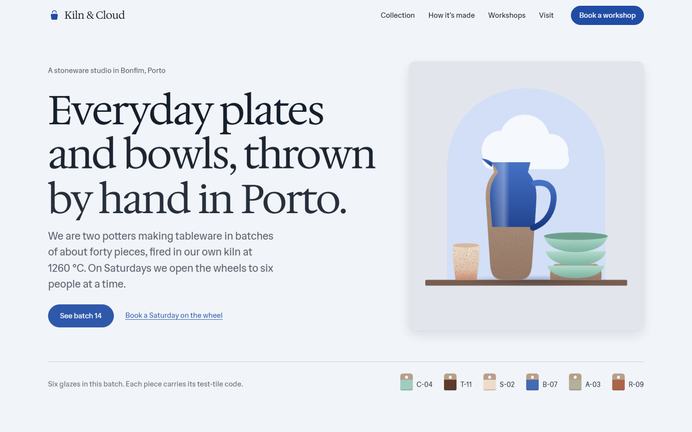
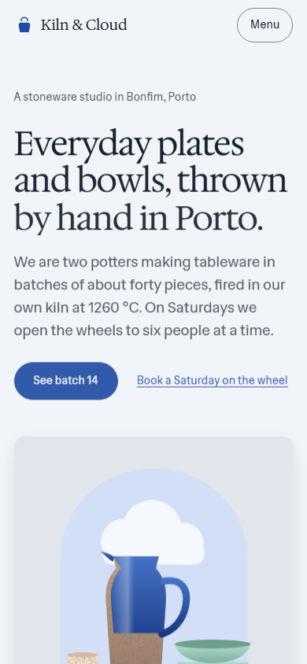

<div align="center">

# ui-craft

**An agent skill for building websites that tell each brand's story in motion, with a structure and look no other brand gets, checked with real screenshots.**

[](https://github.com/rakeshkoyya/ui-craft/actions/workflows/ci.yml)
[](CHANGELOG.md)
[](LICENSE)
[](https://agentskills.io)
[](#claude-code-plugin-recommended)

Works with **Claude Code**, **Codex**, **Cursor**, and any agent that supports the
[Agent Skills](https://agentskills.io) `SKILL.md` format.<br>
Stack-agnostic (plain HTML/CSS, React/Next, Vue/Nuxt, Svelte, Angular, Astro, Tailwind), with
Next.js as the default for new sites.

[Quick start](#quick-start) · [Install](#install) · [Updating](#updating) · [Using it](#using-it) · [Example](#example) · [Contributing](#contributing)



</div>

## Quick start

In Claude Code:

```text
/plugin marketplace add rakeshkoyya/ui-craft
/plugin install ui-craft@ui-craft
```

Then ask for UI as usual: *"Build a website for my construction company that tells our story as you scroll."*
If the brief is thin, the agent asks a few story questions, and every one has a
**"No story yet — generate one for me"** option.

## Why

Coding agents tend to produce the same interface every time: an indigo-to-purple gradient, three
identical cards with emoji icons, Inter for everything, and a fade-up on every element. They say it
"looks great" without ever having seen it. ui-craft changes the process:

| | Without ui-craft | With ui-craft |
|---|---|---|
| **Story** | Generic copy that fits any company | A Story brief (inferred, asked, or generated) with one central metaphor that drives layout, palette, type and motion together |
| **Structure** | The same hero → features → testimonials → CTA skeleton, reskinned | Sitemap and chapters designed from the story: 14 story arcs, **55 section archetypes**, a pacing curve, and a local history so new sites vary from recent ones |
| **Direction** | Generic template look | A one-line direction and dials inferred from the brief, plus tokens that are critiqued before any code |
| **Components** | Hand-rolled, often inaccessible, or invented package names | Search a verified catalog of **~430 real components** from **67 libraries** (native HTML elements included), with exact install and import lines |
| **Motion** | `transition: all 0.3s`, fade-up everywhere | Each chapter's motion performs what it says: a scroll-story scene engine (sticky scenes that build as you scroll, pinned chapters, before/after, route journeys), seven motion languages, 30+ recipes, reduced motion honored |
| **Quality** | "Looks good!" (never looked) | Screenshots at mobile and desktop, timed motion frames, a scored rubric, fix-and-recapture loop |
| **Consistency** | Different every session | Decisions saved to `.ui-craft/design.md` and reused next time |

## What's inside

```
skills/ui-craft/
├── SKILL.md              # the workflow the agent follows (lean; loads the rest on demand)
├── references/           # story, structure, storytelling motion, direction, tokens, typography,
│                         # layout, motion, accessibility, copy, anti-patterns, components,
│                         # visual loop, audit/redesign modes, stacks/*
├── data/                 # searchable CSV catalog: components, libraries, motion, palettes, fonts,
│                         # section archetypes
├── assets/motion/        # motion snippets (scroll reveal, view transitions, GSAP, Lenis, …)
│   └── story/            # scroll-story scene engine + React/Next wrappers
└── scripts/
    ├── search.py         # find components / libraries / motion / palettes / fonts / sections
    ├── history.py        # remembers recent site structures so new ones vary
    ├── contrast.py       # WCAG contrast for colors, CSS token files, and palettes
    ├── slop_lint.py      # 18 rules for mechanical anti-patterns (transition: all, 100vh, …)
    └── capture.mjs       # Playwright screenshots, motion frames, and a UI health report
```

### Find real components, not invented ones

```console
$ python skills/ui-craft/scripts/search.py "date picker" --stack vue
$ python skills/ui-craft/scripts/search.py "animated hero background" --stack react
$ python skills/ui-craft/scripts/search.py "page transition" --stack next
$ python skills/ui-craft/scripts/search.py "luxury quiet" --domain palettes
```

Each result gives the library, the **exact install command and import line**, the docs link, the
license, and the date the entry was last checked against the docs. When nothing matches well enough,
it says so (`No confident match`) rather than guessing, and the agent builds the component on an
accessible pattern instead.

The catalog covers shadcn/ui, Radix, Base UI, React Aria, Headless UI, Mantine, HeroUI, Chakra,
Ark UI, Magic UI, Aceternity UI (free), Motion Primitives, React Bits, shadcn-vue, Reka UI, Nuxt UI,
PrimeVue, Inspira UI, shadcn-svelte, Bits UI, Skeleton, Angular Material, spartan/ui, Web Awesome,
daisyUI, Motion, GSAP, Lenis, Lucide, Phosphor, Recharts, ECharts and more.

### See the page, then fix it

```console
$ node skills/ui-craft/scripts/capture.mjs http://localhost:3000 --full-page --motion
```

This captures screenshots at 390 / 768 / 1440 px, timed frames after load (0 to 1000 ms), and a
scroll filmstrip. It writes a report covering horizontal overflow, console errors, failed requests,
missing alt text, small tap targets, the fonts that actually rendered, layout shift, and every
running animation (flagging ones that animate layout properties). The agent looks at the images,
scores them against a 10-dimension rubric, fixes the three biggest problems, and captures again.

## Install

The skill is the folder `skills/ui-craft`. Put it wherever your agent looks for skills.

### Claude Code plugin (recommended)
```text
/plugin marketplace add rakeshkoyya/ui-craft
/plugin install ui-craft@ui-craft
```

### Any agent, via the skills CLI
```bash
npx skills add rakeshkoyya/ui-craft
```

### Manual copy

| Agent | Project scope | User scope |
|---|---|---|
| Claude Code | `.claude/skills/ui-craft` | `~/.claude/skills/ui-craft` |
| Codex | `.agents/skills/ui-craft` | `~/.agents/skills/ui-craft` or `~/.codex/skills/ui-craft` |
| Cursor | `.agents/skills/ui-craft` or `.cursor/skills/ui-craft` | `~/.cursor/skills/ui-craft` |
| Others | `.agents/skills/ui-craft` (cross-agent convention) | `~/.agents/skills/ui-craft` |

```bash
git clone https://github.com/rakeshkoyya/ui-craft
cp -r ui-craft/skills/ui-craft ~/.claude/skills/     # or another path from the table
```

### Requirements

- **Python 3.9+** for `search.py`, `contrast.py`, `slop_lint.py`. They use only the standard
  library, so there's nothing to install.
- **Node 18+ and Playwright** for screenshots: `npm i -D playwright && npx playwright install chromium`
  in the project being built. If your agent already has a browser tool (Playwright MCP, Chrome
  DevTools MCP), the skill can use that instead.

## Updating

Releases are listed in [CHANGELOG.md](CHANGELOG.md).

| Installed with | How to update |
|---|---|
| Claude Code plugin | `/plugin marketplace update ui-craft`, then update ui-craft from `/plugin`. To get updates automatically, open `/plugin` → Marketplaces → `ui-craft` → enable auto-update. |
| skills CLI | `npx skills update` |
| `git clone` | `git pull` in the cloned folder (copy `skills/ui-craft` again if you copied it elsewhere) |

## Using it

Ask for UI as usual. The skill triggers on website, landing page, redesign, polish and review
requests:

> Build a one-page site for a ceramics studio in Porto — calm, crafted, with smooth motion.

> Review the pricing page for accessibility and anything that looks templated.

> Add a smooth page transition between the blog index and posts.

The agent states its direction, sets tokens, searches for components, builds, lints, captures,
critiques, fixes, and reports back with scores and screenshot paths.

## Example

[`examples/kiln-and-cloud/`](examples/kiln-and-cloud/) is a site an agent built using only this skill
and a short brief. It includes the design memory file and the agent's own feedback on the skill.

| Desktop | Mobile |
|---|---|
|  |  |

## Contributing

Catalog rows, lint rules, motion recipes and stack notes are all welcome. See
[CONTRIBUTING.md](CONTRIBUTING.md). The data and script interfaces are defined in
[docs/CONTRACTS.md](docs/CONTRACTS.md).

## License

[MIT](LICENSE). Libraries in the catalog have their own licenses, recorded per row. Some (for example
GSAP, PrimeVue v5, Aceternity UI, React Bits) are not MIT, so check before shipping.

## Acknowledgements

Informed by studying public skills including Anthropic's `frontend-design` and `skill-creator`,
Vercel's `web-design-guidelines`, UI/UX Pro Max, taste-skill, interface-design, SuperDesign and
superpowers' `writing-skills`. No text or code was copied from them.

## Author

Built by [Rakesh Koyya](https://github.com/rakeshkoyya). Issues and pull requests are welcome at
[github.com/rakeshkoyya/ui-craft](https://github.com/rakeshkoyya/ui-craft/issues).
